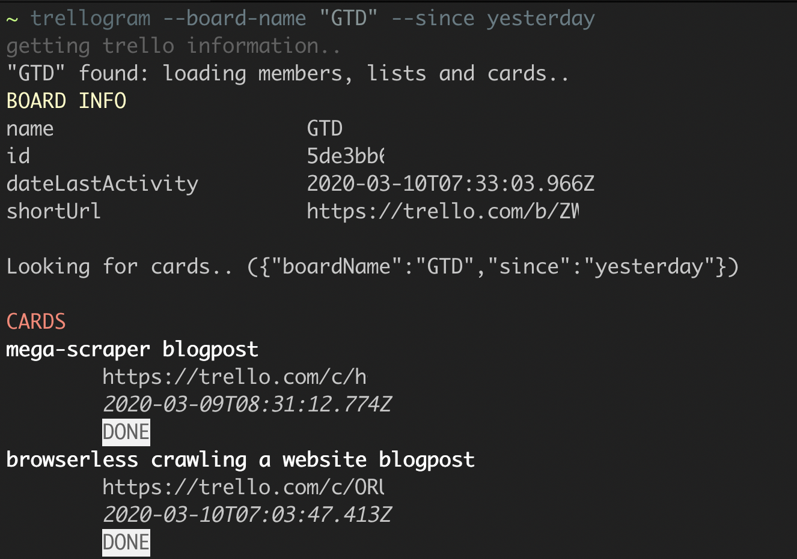

# trellogram

trello board recap to your telegram.

without `--telegram-token` and `--telegram-user-id` it prints a recap in the terminal
```bash

npm i -g trellogram

# or

npx trellogram ...
```



## run

```bash
npx trellogram --board-name "BOARD_NAME" --since yesterday --member MEMBER_NAME --key TRELLO_API_KEY --token TRELLO_API_TOKEN
```

## output

```
> trellogram --board-name "GTD" --since yesterday

getting trello information..
"GTD" found: loading members, lists and cards..
BOARD INFO
name			 GTD
id			 XXX
dateLastActivity	 2020-03-10T07:33:03.966Z
shortUrl		 https://trello.com/b/XXXXXX

Looking for cards.. ({"boardName":"GTD","since":"yesterday"})

CARDS
mega-scraper blogpost
	https://trello.com/c/XXXXXX
	2020-03-09T08:31:12.774Z
	DONE
browserless crawling a website blogpost
	https://trello.com/c/XXXXXX
	2020-03-10T07:03:47.413Z
	DONE
```

## options

### --board-name

choose a board name

### --member

filter for cards assigned to a member

### --since

filter cards after a certain date

### --until

filter cards before a certain date

### --telegram-token

the telegram bot token

### --telegram-chat-id

the telegram chat id
